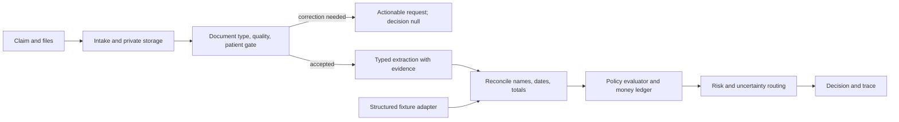

# OPD claims processor architecture

## Purpose and boundary

This application demonstrates a defensible route from a member's OPD documents to an explainable policy outcome. The submission contains two input adapters: actual image/PDF uploads, and the assignment's structured fixtures. Both feed the same normalized evidence and deterministic policy evaluator. The fixtures prove rule behavior; they do not prove OCR accuracy.

The final authority for a claim is code reading `policy_terms.json`, not model prose. Model output is evidence that must pass type, identity, amount, and policy checks. Repairable document problems stop before adjudication with `decision: null`. Material uncertainty routes to human review. A decision record keeps claim state and decision separate, because a claim can be awaiting a replacement document without being rejected.

## Components and responsibilities

| Component | Responsibility | Boundary |
| --- | --- | --- |
| Web/API | Receive claim metadata and files, persist state, display corrections and review output | Does not decide claims |
| Document adapter | Validate media, classify type and quality, extract fields with source evidence | Does not interpret policy |
| Fixture adapter | Normalize the provided JSON cases into document evidence | Uses fixture metadata explicitly; does not claim OCR happened |
| Reconciler and policy core | Check consistency, apply ordered rules, calculate integer-paise ledger | Does not call a model or alter source documents |
| Trace store | Record stage, status, rule/policy reference, evidence, decision and degradation | Avoids raw health data in ordinary logs |
| Review UI and operations worklist | Show outcome, amount arithmetic, evidence, model usage, escalation signals, and failed/skipped checks | Human reviewer remains responsible for uncertain cases; `/ops` has no production authentication |

The specialists are bounded by typed data: document gate, extraction, ambiguity handling, policy reduction, and decision validation. `claims.agent_pipeline` verifies the evidence-agent envelope and re-runs the document gate after accepted Gemini candidates; it checks the final decision and amount before persistence. Malformed or inconsistent policy output becomes `MANUAL_REVIEW` with zero approved amount. Gemini requires an explicit local opt-in; with opt-in enabled, a clear document set returns `NOT_NEEDED` without a model call. Sarvam Document AI and Gemini are the two model-backed specialist components; neither can decide coverage or calculate payment. The rules engine is deterministic so a reviewer can recompute every payable amount from the policy, source facts and ledger. Detailed prompts and handoffs are in [the agent pipeline design](agent-pipeline.md).

## Document path and cost choices

The application first checks file type, size and pages. A digital PDF can yield local text without an API call. Image/scanned-PDF evidence uses Sarvam Document AI digitisation when configured. The gate asks only for type, readability and patient identity needed to decide whether to continue. Detailed schema extraction is requested only when accepted documents lack material fields after local parsing. Ambiguous material fields trigger another supported extraction pass or manual review. These paths must be compared on the same labelled documents before claiming an accuracy improvement.

At current published list prices, [Sarvam Document AI](https://www.sarvam.ai/api-pricing) lists digitisation at ₹0.50/page and schema extraction at ₹1/page. A three-page scan therefore costs ₹1.50 for digitisation, or ₹4.50 if every page also needs schema extraction, before retries, taxes, storage, compute and human review. The application records endpoint usage and page counts per claim. Compare **cost per correctly resolved claim**, including re-upload and reviewer work, rather than API price alone. These are list-price scenarios, not measured usage.

## Rule interpretation and trace

Policy limits apply identically to fixtures and uploaded claims. TC006 is rejected because its requested amount exceeds the configured global per-claim limit; the dental report is optional because the document matrix is authoritative. In an insurer integration, policy ownership must still confirm this interpretation before automatic payment.

Each trace event records a stage, rule ID, status, policy reference and evidence or explanation. `NOT_EVALUATED` is distinct from `PASS`; for example, the 30-day submission deadline cannot be checked when a fixture has no submission timestamp. Exclusion and waiting period can dominate a financial cap as the primary reason while the trace still shows the other checks. Line items and adjustments use integer paise and explicit order: eligible items, caps, network discount, then co-pay. A separate confidence score records evidence quality and degraded processing. It is not a calibrated probability until measured against labelled outcomes.

At intake, every uploaded document's SHA-256 is stored. After the document gate identifies bills, the workflow checks those exact file hashes against prior claims and routes matches to manual review before policy adjudication. A byte-identical bill is strong duplicate evidence but transformed scans can evade this check, so production should add normalized bill identifiers and amount/date/provider similarity with a human review threshold. Same-day and monthly counts use saved claims for the policy member and covered dependents. Policy-year usage sums prior `APPROVED` and `PARTIAL` decisions. Since this prototype has no insurer remittance event, approved amount is a disclosed proxy for consumed benefit, not proof of payment. Schema indexes support member/date and hash lookups, and startup backfills those fields from older local claim rows.

## Failure handling

- Invalid or missing files: return a precise correction request and keep decision null.
- Provider timeout or invalid extraction: bounded retry; if material evidence remains absent, request replacement or route to review. Never invent extracted values.
- Cross-document patient or amount mismatch: stop adjudication or route to review with the conflicting evidence shown.
- Optional risk enrichment failure: record `SKIPPED_COMPONENT_FAILURE`, lower confidence and recommend review while preserving a decision supported by mandatory checks. This is the explicit TC011 path.
- Database or storage failure: preserve an error state and retryable job rather than silently dropping a claim.

## Data, safety and operational load

The prototype uses local private uploads and SQLite. At 75,000 claims/year, average traffic is roughly 205 claims/day; 10× is about 2,055/day. A service fleet is not justified by that average. The first scaling step is Postgres, object storage, separate workers and a managed queue with idempotent jobs, provider rate limits and backpressure. Partition or archive trace/document metadata only when retention and query load require it. Monitor p95 time to feedback, correction cycles, reviewer minutes, provider failure rate, and incorrect approval/rejection rates.

Synthetic documents are the safe prototype input. Real patient documents require access controls, retention rules, encryption, a vendor data-processing review and a confirmed policy owner before automated payment decisions. No production data or production migrations are needed for this assignment.

## Considered and rejected for this timebox

- Microservices and a broker: extra deployment and failure surfaces for one narrow workflow.
- A general agent orchestration framework: model calls would obscure decisions and increase cost. Bounded specialist functions provide the useful separation.
- LLM-generated policy decisions or arithmetic: hard to reproduce and unsafe for payment logic.
- Fixture-only demo: would leave the actual upload requirement unproven.
- Universal OCR on every PDF page: incurs cost where selectable PDF text already exists; benchmark it only if quality demands it.

## Current limitations to report honestly

The 12 fixtures contain no actual images/PDFs; their pass rate says nothing about handwriting or Indic-language accuracy. Confidence is a transparent heuristic pending calibration. Policy conflicts need an insurer decision. Real upload quality and provider cost depend on labelled sample results, available credentials, and platform-specific OCR capability. The final evaluation report should state which paths were exercised and which were not.
